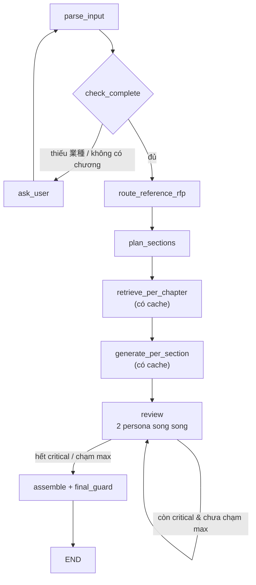

# Kiến trúc hệ sinh hồ sơ thầu (case_e_rfp)

> **Bắt tay vào code → đọc [BUILD_GUIDE.md](BUILD_GUIDE.md)** (hợp nhất file này + EVAL.md thành
> 12 bước có tiêu chí nghiệm thu). File này là phần *vì sao*; BUILD_GUIDE là phần *làm thế nào*.

Mục tiêu: từ 1 bản RFP (paste text) → sinh ra **hồ sơ thầu tiếng Nhật**, mỗi câu **truy được về nguồn**,
đáp ứng requirement của RFP và **không vượt quá năng lực thật của công ty**.

Hai nguồn sinh, thẩm quyền khác nhau — đây là trục thiết kế chính:

| Nguồn | Vai trò | Cách truy xuất | Thẩm quyền |
|---|---|---|---|
| `synthetic/capability_sheet.json` | **Sự thật** về năng lực / chứng chỉ / quy mô | Lookup theo khóa (KHÔNG vector) | Cao nhất — là trọng tài cuối |
| `synthetic/proposals/*.txt` (40 file) | **Văn phong + precedent** (cách diễn đạt, thành tích số) | Hybrid retrieve theo câu | Thấp — dữ liệu bẩn, phải gate |
| `synthetic/certs/fake_iso27017.txt` | **Negative fixture** cho eval | Không index vào luồng sinh | Cấm — dùng làm red-team input |

---

## 0. Đặc thù dữ liệu quyết định kiến trúc

Đọc data thấy 3 điều bắt buộc phải xử lý, nếu bỏ qua thì sản phẩm sai về bản chất:

1. **Kho proposal cũ có rò rỉ khách hàng.** `PROP-002`: 「新生証券様向けの構築において…」, `PROP-009`: 「北陸食品様向け…」.
   `proposals_index.jsonl` gắn cờ `contains_client_leak` cho ~8/40 file. Nếu retrieve thô rồi ném vào LLM,
   tên khách hàng thật sẽ chảy thẳng vào hồ sơ mới.
2. **Kho proposal cũ có claim bịa.** `PROP-009` viết 「当社はISO/IEC 27017認証を取得済み」 trong khi
   `capability_sheet.certifications_NOT_held` có đúng `ISO/IEC 27017`. `PROP-005` bịa ブロックチェーン決済基盤.
   → precedent **không được tự chứng minh chính nó**; mọi claim phải đối chiếu capability sheet.
3. **Output là văn bản dài, không phải câu trả lời.** Không dùng pattern "retrieve 1 lần → gọi LLM 1 lần".
   Phải: plan cấu trúc → retrieve **theo từng chương** → sinh **theo từng mục** → verify → ghép.

Nguyên tắc xuyên suốt: **chunk = 1 câu**. Vì đơn vị output cũng là câu, nên trace 1-1, khử trùng lặp dễ,
và verify từng câu được. Đây chính là thứ render ra bảng "Xem nguồn từng câu" trong UI.

---

## 1. Tầng dữ liệu (offline, chạy 1 lần khi build index)

```
raw/*.pdf ─(không dùng cho luồng sinh; chỉ để mở rộng nếu muốn RFP thật)
synthetic/rfps/*.txt      ──► RFPParser      ──► rfp_chapters (3 RFP mẫu)
synthetic/proposals/*.txt ──► ProposalParser ──► sentence units ──► Sanitizer ──► index
synthetic/capability_sheet.json ────────────────────────────────► capability_facts (KV store)
```

### 1.1 RFPParser
Data rất đều (`第N章 <tiêu đề>` / `N.M <nội dung>`) → **regex trước, LLM sau**:
- regex bắt được → dùng luôn (0 token, deterministic).
- không bắt được (người dùng paste text tự do) → fallback LLM structured output về đúng schema.

```python
Chapter    = {id: "ch2", title: "業務要件", requirements: [Requirement]}
Requirement= {req_id: "2.3", text: "同時接続ユーザ500名以上に対応すること。"}
RFP        = {rfp_id, title, industry: "製造業", chapters: [Chapter]}
```

`industry` (発注業種) là metadata quan trọng nhất để chọn precedent — bắt riêng.

### 1.2 ProposalParser
Tách theo mục `1. 会社概要 … 5. 推進体制` → tách câu theo `。` và bullet `・`. Mỗi câu 1 record:

```python
Sentence = {
  sent_id: "PROP-S03-095a7d34",     # id ổn định = hash(proposal_id + section + text)
  proposal_id: "PROP-033",
  responds_to: "RFP-2025-003",       # → join ra industry của proposal đó
  section: "導入実績",
  text: "…在庫精度を30%向上した実績があります。",
  claim_kind: "metric" | "certification" | "capability" | "company_fact" | "boilerplate",
  flags: {client_leak: bool, contradicts_capability: bool}
}
```

### 1.3 Sanitizer (chốt chặn số 1, chạy lúc ingest — không phải lúc sinh)
- **Client leak**: pattern `<danh từ riêng>様向け` + NER tổ chức. Tên chung
  (大手金融機関様 / 中堅メーカー様 / 公共機関様) → giữ; tên riêng cụ thể → mask về tên chung, hoặc drop câu.
- **Claim bịa**: mọi câu `claim_kind ∈ {certification, capability}` đem đối chiếu capability sheet
  (`certifications_held` vs `NOT_held`, `capabilities` vs `capabilities_NOT_offered`).
  Mâu thuẫn → `quarantined = true`, **loại khỏi index sinh**, giữ lại làm eval set.

> `proposals_index.jsonl` chỉ dùng để **đo** precision/recall của Sanitizer, **không** dùng làm luật runtime —
> vì RFP thật sẽ không có nhãn. Đây là chỗ ghi được 1 con số đẹp trong báo cáo:
> "bộ lọc leak bắt 8/8 file, 0 false positive".

### 1.4 Hai store
- `proposal_sentences`: **hybrid** (dense embedding + BM25), metadata filter theo `section`, `industry`, `claim_kind`.
  Quy mô nhỏ (~300 câu) → FAISS/Chroma là đủ, không cần hạ tầng nặng.
- `capability_facts`: **KV, không embed**. Mỗi fact có key ổn định + template câu tiếng Nhật:

```python
"company_facts:established" → {value: 1992, template: "{y}年設立であるため、継続的な事業運営に基づく対応が可能です。"}
"company_facts:headcount"   → {value: 1800, ...}
"capabilities:クラウド移行（AWS・Azure）" → {template: "クラウド移行（AWS・Azure）により、…対応が可能です。"}
"certifications:ISO/IEC 27001" → {...}
```

Key này chính là nhãn `[bảng năng lực · company_facts:established]` hiện trong UI trace.

### 1.5 Blocklist cứng
`certifications_NOT_held ∪ capabilities_NOT_offered` → regex blocklist. Kiểm tra ở **2 chỗ**:
lúc ingest (1.3) và lúc xuất bản (§2.5). Cert giả `fake_iso27017.txt` phải bị chặn kể cả khi ai đó
cố tình nhét nó vào kho — vì trọng tài là capability sheet, không phải tài liệu retrieve được.

---

## 2. Luồng runtime (LangGraph)



Hai node có nền cache là `retrieve_per_chapter` và `generate_per_section` (§2.8).
`review` **không** cache vì kết quả phụ thuộc số vòng đã chạy. `assemble` — nơi
`final_guard` chạy — cũng không cache, nên **mọi hồ sơ xuất ra đều qua guard**,
kể cả khi toàn bộ phần sinh là cache hit.

### 2.1 `parse_input` → `check_complete` → `ask_user`
Thiếu `業種` hoặc không tách được chương nào → hỏi lại người dùng thay vì đoán bừa.
(Đây là màn hình "Chưa đủ thông tin để sinh nháp. Còn thiếu: 業種, nội dung RFP".)

### 2.2 `route_reference_rfp`
Chọn 1 trong 3 RFP mẫu làm **RFP tham chiếu** → ưu tiên precedent từ proposal `responds_to` RFP đó.
Thứ tự thử, dừng ở cái đầu tiên khớp (ghi lại `method` để hiện ra UI):
1. `industry` khớp chính xác → `method="industry"`, cost 0 lệnh gọi LLM.
2. embedding similarity giữa chương 調達概要 → `method="embedding"`.
3. không khớp → `method="none"`, chạy thuần capability + precedent chung.

### 2.3 `plan_sections` — bảng ánh xạ (config, KHÔNG để LLM tự quyết)

| Mục proposal (output) | Chương RFP nguồn |
|---|---|
| 会社概要 | — (mục cố định, chỉ từ capability sheet) |
| 提案の概要 | 調達概要 |
| 導入実績 | 業務要件, 技術要件 |
| 認証・コンプライアンス | セキュリティ要件 |
| 推進体制 | 納期・体制, 提案書記載事項 |

Cố định bảng này → cấu trúc output ổn định giữa các lần chạy, và render thẳng ra UI được.
Chương RFP lạ (không khớp mục nào) → đẩy vào `導入実績` + log cảnh báo.

### 2.4 Retrieval — 4 bước, chạy song song theo từng chương

```
[Kênh thuộc tính] → [Query embed] → [Chấm điểm/rerank] → [MMR]
```

1. **Kênh thuộc tính** — deterministic, luôn chạy, 0 LLM. Đối chiếu requirement với từ vựng đóng của
   capability sheet: `クラウド基盤（IaaS）` → `capabilities:クラウド移行（AWS・Azure）`;
   `ISO/IEC 27001相当` → `certifications:ISO/IEC 27001`. Đây là kênh **an toàn nhất** vì không qua LLM.
2. **Query embed** — chỉ chạy **khi kênh 1 chưa phủ hết** requirement của chương. Chương đã phủ đủ →
   skip 3 bước sau (tiết kiệm thật, và hiện ra UI thành node "bỏ qua").
3. **Chấm điểm/rerank** — `score = α·dense + β·bm25 + γ·industry_match + δ·same_section_prior`,
   rerank top-20 → top-8 bằng cross-encoder (hoặc LLM-rerank nếu chấp nhận latency).
4. **MMR** — bắt buộc. Kho proposal lặp cực nhiều (40 file gần như cùng khung, chỉ khác số liệu);
   không MMR thì top-k toàn câu trùng nghĩa. Đây là con số "32 câu nguồn → 12 câu" trong UI.

### 2.5 Generation — 5 bước, chạy theo từng mục output

```
[Sinh câu precedent] → [Sinh câu capability] → [Ghép câu G3] → [Claim-check tầng 2] → [Kiểm độ đáp G6]
```

1. **Sinh câu precedent** — từ câu proposal đã retrieve. Rewrite nhẹ, **giữ nguyên văn số liệu**
   (cấm LLM sinh số mới), giữ `sent_id` gốc để trace. Không có precedent → skip, không bịa.
2. **Sinh câu capability** — từ `capability_facts` bằng template + LLM chỉ làm nhiệm vụ mượt câu.
   Đây là kênh luôn có, đảm bảo mục nào cũng có nội dung neo được vào sự thật.
3. **Ghép câu (G3)** — merge 2 luồng, sắp thứ tự (fact → capability → precedent → kết), chèn **câu nối**
   (`origin="bridge"`, không có nguồn). Câu nối phải được đếm riêng và in nghiêng ở UI:
   "11/12 câu truy được về một câu nguồn đã verify (1 câu nối không có nguồn để neo)".
4. **Claim-check tầng 2** — tách claim từ từng câu → verdict đối chiếu capability sheet + câu nguồn:
   - `VERIFIED` — khớp fact hoặc khớp nguyên văn câu nguồn đã sanitize.
   - `UNVERIFIABLE` — không mâu thuẫn nhưng không có nguồn (thường là câu nối) → giữ, đánh dấu.
   - `CONTRADICTED` — mâu thuẫn capability sheet → **xóa câu, rewrite mục**. Đây là chốt chặn 27017.
5. **Kiểm độ đáp (G6)** — đối chiếu requirement của chương với câu đã sinh → trạng thái mục:
   - `OK` — mọi requirement được phủ.
   - `ATTRIBUTE_ONLY` — chỉ phủ bằng kênh thuộc tính, không có precedent hỗ trợ.
   - `INSUFFICIENT_EVIDENCE` — không đủ → **ghi chú công khai** thay vì bịa
     ("業務要件/技術要件 không có chunk trực tiếp đáp ứng yêu cầu").

### 2.6 `review` — chỉ soi chất lượng văn bản (v1.2 · multi-persona v1.3)

Nằm **giữa** `generate_per_section` và `assemble`. Hai vị trí khác đều bị loại vì lý do cứng:
đặt *trong* `generate_per_section` sẽ phá cache (§2.8 — cùng một key ứng với nhiều kết quả tuỳ số
vòng đã chạy); đặt *sau* `assemble` là xuất bản thứ chưa qua guard, vi phạm BB-2.

**Hai persona chạy song song** — `coverage` (mạch lạc, đủ ý, thứ tự) và `quality` (văn phong, trùng
lặp, thống nhất cách viết). Chỉ có một model nên phân hoá bằng **prompt**, không bằng model size.
Issue được gộp theo `(section_key, issue_type)`, **giữ bản severity nặng nhất** — giữ bản gặp trước
sẽ biến một lỗi `critical` thành `major` tuỳ thứ tự chạy.

> ⚠ **Cố tình KHÔNG có persona Compliance.** Nó sẽ phán về chứng chỉ giả và over-claim, tức giẫm lên
> BB-2 (§1.5) và BB-1 (§1.4). Judge LLM sai 5–10%; ở đây sai một lần là hồ sơ tuyên bố sai chứng chỉ.
> Một reviewer "hiền" báo sạch không làm hồ sơ sạch hơn, nhưng tạo cảm giác đã có người canh — kiểu
> hỏng nguy hiểm nhất. Compliance ở lại tầng deterministic.

`issue_type` là **từ vựng đóng** thuần chất lượng (`structure` · `tone` · `redundancy` ·
`unclear_reference` · `format`); issue ngoài từ vựng hoặc trỏ sai `section_key` bị bỏ, không đoán ý
model. Chỉ mục có issue `critical` mới được sinh lại; câu không bị chỉ ra giữ nguyên từng byte, và
bản sửa bị **từ chối** nếu đổi số liệu/metric, thêm ký tự trang trí, hoặc lỡ thêm chuỗi cấm. Mọi câu
giữ nguyên `origin`/`source_id`/`req_ids`/`verdict` (BB-4).

Vòng lặp dừng khi: hết `critical`, hoặc vòng vừa rồi không sửa nổi câu nào, hoặc chạm
`MAX_REVIEW_ROUNDS`. Tắt hẳn bằng `REVIEW_ENABLED`.

### 2.7 `final_guard`
Trước khi xuất: quét lại toàn văn bằng blocklist (§1.5) + pattern tên riêng khách hàng.
Dính → fail loud, không xuất bản im lặng. Đây là lớp phòng thủ độc lập với LLM, và là **node cuối
cùng** — chạy sau cả review loop, nên không đường nào đi vòng qua nó.

Blocklist khớp cả **biến thể** chứ không chỉ nguyên văn: `ISO 27017` · `ISO27017` · `ISO-27017` ·
`IEC 27017` · `ISO/IEC27017:2015` · full-width · và số trần `27017` khi đứng cạnh ngữ cảnh chứng chỉ.
Cùng một bộ regex dùng cho cả hai lần kiểm (ingest + xuất bản).

Khi **xuất file** (§3), guard chạy trên **phần hệ sinh ra**, không trên toàn file: bảng đối chiếu
trích nguyên văn yêu cầu của bên mời thầu, mà một RFP hoàn toàn có thể *yêu cầu* ISO/IEC 27017. Điều
BB-2 cấm là hệ thống **tự nhận** có chứng chỉ đó.

### 2.8 State schema (hợp đồng giữa các node — cũng là thứ render ra toàn bộ UI)

```python
State = {
  "rfp": RFP,
  "reference_rfp": {rfp_id, method, score},
  "chapters": [{...Chapter, retrieval: {stages: {...}, candidates: [Sentence], selected: [Sentence]}}],
  "sections": [{
      key, title_ja, title_vi,
      source_chapters: [chapter_id],
      sentences: [{text, origin: "capability"|"precedent"|"bridge", source_id, req_ids, verdict}],
      status: "OK"|"ATTRIBUTE_ONLY"|"INSUFFICIENT_EVIDENCE",
      note: str | None,
  }],
  "trace": {llm_calls, retrieval_stats, dedup: {before, after},
            review: {enabled, rounds, history: [{round, score, critical_sections, personas}]}},
}
```

### 2.9 Cache (v1.2) — vì sao ở mức node

Cache key gồm **mọi thứ có thể đổi kết quả**: `rfp_text` · `prompt_version` · `template_version` ·
`model` · `retrieval_config` (gồm cả 3 cờ ablation) · `corpus_fingerprint` · `capability_fingerprint`.
Hai vân tay băm **nội dung** chứ không băm mtime — clone lại repo hay dựng lại index trên máy khác
không được sinh miss giả. Corpus băm **sau sanitize** kèm số câu quarantine, nên nới/siết blocklist
cũng đổi vân tay.

Cache đặt ở **mức node**, không phải mức mục, vì các mục **không độc lập**: `used_fact_keys` tích luỹ
qua vòng lặp trong `generate_per_section` nên output của mục thứ 3 phụ thuộc mục 1–2 đã dùng fact nào.
Cache từng mục rồi ghép lại sẽ cho ra hồ sơ **lặp fact**. Muốn hạ đơn vị cache (cần cho chat-refine)
thì phải tách việc phân bổ fact thành bước tiền xử lý tất định và chạy eval riêng chứng minh hành vi
không đổi — đó là lý do #12/#13/#14 được hoãn có chủ đích.

Mọi đường chạy trong `eval/` **ép tắt cache**, hardcode 3 tầng không đọc cấu hình: cache hit làm token
sản phẩm đo được về gần 0 và phá bảng ablation §11.3.

---

## 3. UI (Streamlit)

- **Graph trực tiếp**: `st.graphviz_chart` re-render mỗi bước từ `graph.stream()` —
  xanh lá = xong, xanh dương = đang chạy, xám nét đứt = bỏ qua. Node bỏ qua là bằng chứng
  trực quan cho phần tối ưu ở §2.4 bước 2.
- **2 cột**: trái = bản JP hoàn chỉnh; phải = panel đối chiếu (bản dịch VI của RFP + proposal,
  bảng "Mục proposal ← chương RFP nguồn", bảng tổng kết verdict).
- **Expander mỗi mục**: "Xem nguồn từng câu" (`[bảng năng lực · company_facts:headcount]` /
  `[PROP-S03-095a7d34]` / `[câu nối]`), "Vì sao chọn các đoạn này" (điểm số retrieval),
  "Luồng xử lý" (số lệnh gọi từng giai đoạn).
- **Dịch VI**: chạy 1 lần ở cuối, cache theo hash nội dung. **Không** nằm trong luồng sinh —
  chỉ để người Việt review. Sinh thẳng tiếng Nhật, không sinh VI rồi dịch sang JP.

---

## 4. Eval — trục để "giải thích vì sao chọn phương án"

> Thiết kế đầy đủ (cách chiếu bài toán sinh văn bản về schema QA của RAGAS/DeepEval,
> ma trận biến thể RAG/agent, mở rộng test set) ở **[EVAL.md](EVAL.md)**. Dưới đây là bản rút gọn.

Golden set: 3 RFP mẫu → ideal proposal viết tay, lưu `synthetic/golden_test_set/`.

**Nhóm 1 — An toàn (quan trọng nhất, phải tuyệt đối):**
- `fabrication_rate`: số câu nhắc 27017 / blockchain / 量子暗号 / AI医療画像診断 → **phải = 0**.
- `leak_rate`: số tên khách hàng thật lọt ra → **phải = 0**.
- **Red-team**: nhét `fake_iso27017.txt` vào kho tri thức rồi chạy lại RFP-2025-001 (có chương セキュリティ要件).
  Hệ thống vẫn phải từ chối nhắc 27017 → chứng minh trọng tài là capability sheet, không phải retrieval.

**Nhóm 2 — Chất lượng:**
- `coverage`: % requirement atom được phủ (lấy từ G6).
- `groundedness`: % câu có `source_id` ≠ null (loại câu nối).
- RAGAS `faithfulness` + `context_precision`, hoặc DeepEval `FaithfulnessMetric`.
- Retrieval `recall@k`: chương RFP-X ↔ câu từ proposal có `responds_to == RFP-X` (nhãn có sẵn, miễn phí).

**Nhóm 3 — Ablation (bảng so sánh cho báo cáo):**

| Cấu hình | fabrication | coverage | faithfulness | latency |
|---|---|---|---|---|
| Chỉ capability sheet | 0 | thấp | cao | thấp |
| Chỉ precedent (proposal cũ) | **>0** ← chứng minh vì sao cần gate | cao | thấp | trung bình |
| Cả 2, không claim-check | >0 | cao | trung bình | trung bình |
| **Cả 2 + claim-check + MMR** | 0 | cao | cao | cao |
| … + bỏ rerank | 0 | trung bình | cao | trung bình |

Bảng này là lập luận chính: **một mình precedent thì bịa, một mình capability thì rỗng** —
phải dùng cả hai, cộng với claim-check làm trọng tài.

---

## 5. Lộ trình build

| Bước | Việc | Kết quả kiểm chứng được |
|---|---|---|
| 1 | RFPParser + ProposalParser + Sanitizer | in ra 8 file bị gắn cờ leak, khớp `proposals_index.jsonl` |
| 2 | 2 store + capability templates | tra `capabilities:クラウド移行` ra câu JP hợp lệ |
| 3 | Graph chạy end-to-end với template rỗng | ra đủ 5 mục, chưa cần hay |
| 4 | Retrieval 4 bước + MMR | log "32 câu → 12 câu" |
| 5 | Generation 5 bước + claim-check | red-team 27017 trả về `CONTRADICTED` |
| 6 | UI trace + graph + dịch VI | đúng như bản demo |
| 7 | Eval + ablation | bảng §4 |

Làm đúng thứ tự này thì bước 3 đã có sản phẩm chạy được đầu-cuối, các bước sau chỉ nâng chất lượng —
không bao giờ rơi vào tình trạng "code nhiều mà chưa demo được gì".
